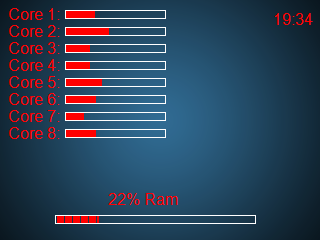

# A system monitor applet for the Logitech G19 & G19s

  <kbd>
    
  </kbd>
  

    <i>
      Exemplary look - configurable
    </i>
  

## Features ##

&rightarrow; Capable of showing the load of 1-x of your CPU cores  
&rightarrow; ads

## How to use ##

### What you need ###

Installed Logitech Gaming Software 8.55 or newer.

Working with following operating systems:

+ Windows XP SP2 (32-bit and 64-bit)
+ Windows Vista (32-bit and 64-bit)
+ Windows 7 (32-bit and 64-bit)
+ Windows 8 (32-bit and 64-bit)
+ Windows 10 (32-bit and 64-bit)

### How to run ###

Download the latest release

Extract the files of the release into your autostart folder (google the right path for your operating system).
The goal is, that G19SystemMonitor.exe will be executed at every launch of windows.  
The release contains following 3 files:

+ G19SystemMonitor.exe (The applet itself)
+ config.cfg (The configuration file in which you can change position and fonts of the elements)
+ background.jpg (An example background picture)

#### Changing the config or the background image ####
###### Configuration ######
If you have come this far and everything is working you chan change the config by editing the config.cfg.
Each displayed element (CPU, RAM and Clock) has its own set of settings. There are comments inside the config.cfg, which should help you to configure the applet as you wish. If you are missing some options please let me know so that I can add them (or add them yourself by doing a pull request).
Please note that the program must be restarted for changes to be applied. (Can be done easily through the task manager).

###### Background ######
You can also change the background image by replacing the file "background.jpg" but with following restrictions:
+ The background image must have 320 x 240 pixel and must be called "background.jpg".
+ At the moment no other filetypes than jpg files are supported.
+ The program must be restarted for changes to be applied. (Can be done easily through the task manager).

## Developer info ##

Anything below this probably doesn't affect end users, so you can stop reading
now if you just want to use the applet.

### Building ###

The build process was tested in following IDEs:

+ Visual Studio 2013 (Pro)
+ Visual Studio 2015 (Enterprise)

Pull the files from this repository and execute the G19SystemMonitor.sln with Visual Studio 2013 or 2015. Newer versions might work but are not tested. After that you should be able to compile the files flawlessly.
If there are errors, please make sure you have installed the Logitech Gaming Software 8.55 or newer.

### Disclaimer ###

If you find anything wrong with the code, or need some other features please let me know so I can improve the code.

## Licence ##

Applet: Copyright &copy; 2018 Patrick Elsässer  
Logitech Gaming Lcd SDK: Copyright &copy; 2014 Logitech Inc.
